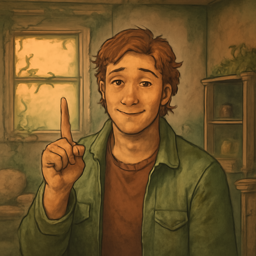
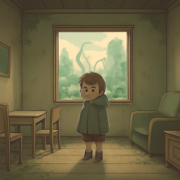
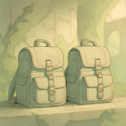
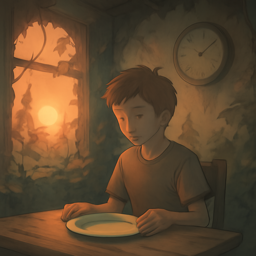
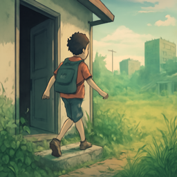
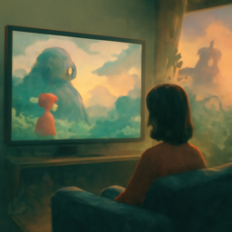

- [HSK1_001](#hsk1_001)
- [HSK1_002](#hsk1_002)
- [HSK1_003](#hsk1_003)
- [HSK1_004](#hsk1_004)
- [HSK1_005](#hsk1_005)
- [HSK1_006](#hsk1_006)
- [HSK1_007](#hsk1_007)
- [HSK1_008](#hsk1_008)
- [HSK1_009](#hsk1_009)
- [HSK1_010](#hsk1_010)
- [HSK1_011](#hsk1_011)
- [HSK1_012](#hsk1_012)
- [HSK1_013](#hsk1_013)
- [HSK1_014](#hsk1_014)
- [HSK1_015](#hsk1_015)
- [HSK1_016](#hsk1_016)
- [HSK1_017](#hsk1_017)
- [HSK1_018](#hsk1_018)
- [HSK1_019](#hsk1_019)
- [HSK1_020](#hsk1_020)
- [HSK1_021](#hsk1_021)
- [HSK1_022](#hsk1_022)
- [HSK1_023](#hsk1_023)
- [HSK1_024](#hsk1_024)
- [HSK1_025](#hsk1_025)
- [HSK1_026](#hsk1_026)

## HSK1_001

### 的 :: particle used to show emphasis or confirmation in a sentence

“This is true.”

这是真的。

### 我 :: I; me (used by the speaker to refer to themselves)

“I like milk.”

我喜欢牛奶。

### 你 :: you (referring to the person being spoken to)

“You are at home.”

你在家。

### 是 :: to be; is, am, are

“I am a student.”

我是学生。

### 了 :: indicates a completed action

“I have eaten.”

我吃了。

### 不 :: no; not

“I don't like it.”

我不喜欢。

### 在 :: in; at; on (to show location or time)

“I am at home.”

我在家。

### 他 :: he; him

“He is at home.”

他在家。

### 我们 :: we; us (refers to the speaker and at least one other person)

 

“We like to eat.”

我们喜欢吃饭。

### 好 :: good

“This rice is good.”

这个饭好。

## HSK1_002

### 有 :: to have; to possess

“I have a book.”

我有书。

### 这 :: this (refers to something nearby or just mentioned)

“This is water.”

这是水。

### 就 :: then; right away; an indicator to stress the result or evaluation

“She left, then I left.”

她走了，我就走。

### 会 :: can (to be able to do something); will (future tense)

“They can sing.”

他们会唱。

### 吗 :: Particle used to form a yes-no question.

“How are you?”

你好吗？

### 要 :: to want or need to do something; must

“I want to go.”

我要去。

### 什么 :: what; used to ask about something unknown

 

“What do you have?”

你有些什么？

### 说 :: to speak or talk

“She speaks.”

她说。

### 她 :: she; her (refers to a woman or girl)

“She is at school.”

她在学校。

### 想 :: to think or want to do something

“I want to eat.”

我想吃饭。

## HSK1_003

### 一 :: the number one

“I have one book.”

我有一本书。

### 很 :: very; quite (used for emphasis before adjectives)

“I am very happy.”

我很高兴。

### 知道 :: to know; to be aware of

 

“I know.”

我知道。

### 人 :: person; people

“They are Chinese people.”

他们是中国人。

### 吧 :: particle used to make suggestions or soften commands

“Let's eat together.”

我们一起吃饭吧。

### 那 :: that (used to refer to something far from the speaker)

“That is my book.”

那是我的书。

### 来 :: to come

“You come.”

你来。

### 都 :: all; every; both

“We are all at home.”

我们都在家。

### 个 :: piece (a measure word for things and people)

“One person.”

一个人。

### 能 :: can; to be able to

“I can smile.”

我能笑。

## HSK1_004

### 去 :: to go

“We go to school.”

我们去学校。

### 没 :: not; not have; without

“I don't have money.”

我没有钱。

### 和 :: and; with (used to connect words or people)

“I walk with you.”

我和你走。

### 他们 :: they; them (referring to a group of people)

 

“They are at school.”

他们在学校。

### 到 :: to arrive; to reach (a place or point in time)

“We arrive home.”

我们到家。

### 对 :: correct; right

“You are right.”

你说得对。

### 也 :: also; too

“I also like it.”

我也喜欢。

### 还 :: still; also; in addition

“I still have books.”

我还有书。

### 做 :: to make or do

“I cook food.”

我做饭。

### 给 :: to give; to hand over (something to someone)

“I give you a book.”

我给你一本书。

## HSK1_005

### 上 :: on; above

“The book is on the table.”

书在桌子上。

### 你们 :: you (plural); you all

 

“You all are here.”

你们在这。

### 过 :: used to show an action happened in the past

“He has been here before.”

他来过。

### 没有 :: not have; there is not

 

“I don't have money.”

我没有钱。

### 看 :: to see or look at

“I see you.”

我看你。

### 真 :: really; truly

“It's really big here.”

这里真大。

### 着 :: a particle showing ongoing action (like "-ing")

“He is singing.”

他在唱歌着。

### 事 :: thing; matter; event

“What is this thing?”

这是什么事？

### 怎么 :: how; in what way

 

“How do you go home?”

你怎么回家？

### 现在 :: now; at this moment

 

“We are at home now.”

现在我们在家。

## HSK1_006

### 点 :: measure word for a small amount or a dot

“There is a little water here.”

这里有一点水。

### 呢 :: particle used at the end of a sentence to turn it into a question or to emphasize something already mentioned

“And you?”

你呢？

### 不客气 :: you're welcome (polite reply to 'thank you')

  

“Thank you! You're welcome.”

谢谢你！不客气。

### 别 :: don't (used to tell someone not to do something)

“Don't go.”

别走。

### 走 :: to walk or to go

“I walk.”

我走。

### 太 :: too; extremely

“He is too happy.”

他太高兴了。

### 里 :: inside; in a space or area

“The book is inside.”

书在里。

### 跟 :: with; to follow; together with

“You come with me.”

你跟我来。

### 女孩儿 :: girl (with erhua, a northern accent)

  

“The girl is smiling.”

女孩儿在笑。

### 告诉 :: to tell or inform (someone)

 

“You tell him.”

你告诉他。

## HSK1_007

### 再 :: again

“Please say it again.”

请再说。

### 听 :: to listen

“They are listening to songs.”

他们在听歌。

### 这里 :: here; this place

 

“They are here.”

他们在这里。

### 快 :: fast; quick

“He is fast.”

他快。

### 谁 :: who; which person

“Who is at home?”

谁在家？

### 多 :: many; much; a lot

“There are many people here.”

这里有很多人。

### 用 :: to use

“I use a phone.”

我用手机。

### 时候 :: moment; time

 

“Now is the time.”

现在是时候。

### 下 :: under; below

“The water is under the table.”

水在桌子下。

### 谢谢 :: thank you

 

“Thank you.”

谢谢你。

## HSK1_008

### 觉得 :: to think or to feel (about something)

 

“I think (it is) good.”

我觉得好。

### 天 :: day

“Today's weather is very good.”

今天的天气很好。

### 请进 :: please come in

 

“Please come in.”

请进。

### 从 :: from (indicates starting point in time or space)

“I come from home.”

我从家来。

### 先生 :: Mr.; sir; a polite way to address a man

 

“Mr. is at home.”

先生在家。

### 找 :: to look for; to try to find

“He is looking for his phone.”

他找手机。

### 最 :: most; to the highest degree

“I like singing the most.”

我最喜欢唱歌。

### 喜欢 :: to like or love something or someone

 

“I like bread.”

我喜欢面包。

### 大 :: big or large

“Big tree.”

大树。

### 次 :: time (of an event); occurrence; next

“May I ask, when is the next time?”

请问，下一次是什么时候？

## HSK1_009

### 出 :: to come out; to go out

“He comes out.”

他出来。

### 干 :: to do or to work

“They are working.”

他们在干。

### 们 :: used after pronouns or person nouns to make them plural

“We are at school.”

我们在学校。

### 话 :: spoken words or speech

“He can speak.”

他会说话。

### 东西 :: thing; object

 

“There is a thing on the table.”

桌子上有东西。

### 孩子 :: child; kid

 

“The child is at home.”

孩子在家。

### 起来 :: to get up; to rise

 

“The student gets up.”

学生起来。

### 这些 :: these (used for multiple things or people close to the speaker)

 

“These books are good to read.”

这些书好看。

### 两 :: two

“Two students are here.”

两个学生在这里。

### 小孩儿 :: child; young child (with '儿' added at the end)

  

“The child is at home.”

小孩儿在家。

## HSK1_010

### 错 :: wrong; incorrect

“This is not right, it is wrong.”

这不对，是错。

### 还有 :: also; in addition

 

“I have rice, and also water.”

我有饭，还有水。

### 小 :: small or little

“The small girl is at home.”

小女孩儿在家。

### 中 :: center; middle

“I am in the center.”

我在中。

### 叫 :: to be called; to have as a name

“She is called little friend.”

她叫小朋友。

### 等 :: and so on; etc.

“I have bread, milk, and so on.”

我有面包、牛奶等。

### 一起 :: together; at the same time

 

“We walk together.”

我们一起走路。

### 拿 :: to take or hold something

“I take (hold) the cup.”

我拿杯子。

### 帮 :: to help

“I help you.”

我帮你。

### 打 :: to hit, to strike, or to play (by hitting)

“He plays ball.”

他打球。

## HSK1_011

### 爱 :: to love or like

“I love mom.”

我爱妈妈。

### 时间 :: time; a period or moment

 

“Time is important.”

时间很重要。

### 年 :: year

“Today is one year.”

今天是一年。

### 请 :: please; to ask or invite someone politely

“Please sit.”

请坐。

### 回 :: to return; to go back

“I go home.”

我回家。

### 工作 :: work; job

 

“He likes work.”

他喜欢工作。

### 见 :: to see or meet someone

“I see her.”

我见她。

### 钱 :: money; cash

“I have money.”

我有钱。

### 一样 :: same; alike

 

“The two bags are the same.”

两个包一样。

### 吃 :: to eat; to have food or a meal

“They are eating a meal.”

他们吃饭。

## HSK1_012

### 开 :: to open or turn on

“Turn on the TV.”

开电视。

### 家 :: home or family

“We are at home.”

我们在家。

### 非常 :: very; extremely

 

“This movie is very good to watch.”

这个电影非常好看。

### 看到 :: to see; to catch sight of

 

“I see her.”

我看到她。

### 那些 :: those (refers to several people or things far from the speaker)

 

“Those students are at the school.”

那些学生在学校。

### 哪 :: which (used to ask about one or more from a group)

“Which book is good?”

哪本书好？

### 行 :: to go; OK; to travel

“We go together.”

我们一起行。

### 朋友 :: friend

 

“A friend is here.”

朋友在这里。

### 妈妈 :: mother; mom

 

“Mother is at home.”

妈妈在家。

### 前 :: the front; the area ahead or in front

“There is a girl at the front.”

前有一个女孩儿。

## HSK1_013

### 这儿 :: here; this place

 

“I am here.”

我在这儿。

### 今天 :: today

 

“Today is good.”

今天好。

### 明白 :: to understand; to know clearly

 

“I understand.”

我明白。

### 车 :: car; vehicle

“The car is big.”

车很大。

### 地方 :: place; area; space; location

 

“This is a place.”

这里是一个地方。

### 几 :: how many; a few

“A few students are sitting at the table.”

几个学生坐在桌子上。

### 回来 :: to come back; to return

 

“The student comes back.”

学生回来。

### 准备 :: to get ready; to prepare

 

“I get ready for the exam.”

我准备考试。

### 找到 :: to find

 

“I found money.”

我找到钱。

### 后 :: at the back; behind

“The car is at the back.”

车在后。

## HSK1_014

### 爸爸 :: father; dad; papa

 

“Dad is at home.”

爸爸在家。

### 比 :: to compare

“I am taller than him.”

我比他高。

### 出来 :: come out; to emerge from inside to outside

 

“The child comes out.”

孩子出来。

### 对不起 :: I'm sorry; excuse me.

  

“Sorry, I came late.”

对不起，我来晚了。

### 问 :: to ask a question

“I ask you.”

我问你。

### 起 :: (a verb, meaning 'to rise' or 'to get up')

“The schoolchild rises.”

小学生起。

### 还是 :: still; or (expressing a choice between options)

 

“Still drink water.”

还是喝水。

### 住 :: to live (in a place); to stay; to reside

“He lives in the house.”

他住在房子里。

### 正 :: exactly; right on time

“It is raining right now.”

现在正下雨。

### 放 :: to put, to place, or to set down something

“I put the book on the table.”

我放书在桌子上。

## HSK1_015

### 请坐 :: Please have a seat.

 

“Please sit.”

请坐。

### 电话 :: telephone; phone call

 

“I have a telephone.”

我有电话。

### 地 :: ground; place; land

“We are on the ground.”

我们在地上。

### 进 :: to enter or go in

“We enter the house.”

我们进房子。

### 新 :: new

“We have new textbooks.”

我们有新课本。

### 您 :: you (polite form)

“You are at home.”

您在家。

### 一些 :: some; a few

 

“There are some buns here.”

这里有一些包子。

### 三 :: three (the number 3)

“Three people are at the school.”

三个人在学校。

### 那里 :: that place

 

“There is a restaurant there.”

那里有饭店。

### 高兴 :: happy; glad

 

“I am very happy.”

我很高兴。

## HSK1_016

### 老 :: old; elderly (used for people or things)

“The elderly person sits next to the table.”

老人坐在桌子旁边。

### 先 :: earlier; first; before others

“Come first.”

先来。

### 买 :: to buy or purchase

“I bought fruit.”

我买了水果。

### 医生 :: doctor; a person who treats sick people

 

“The doctor is at home.”

医生在家。

### 最后 :: final; last; at the end

 

“Eat at the end.”

最后吃饭。

### 手 :: hand

“He has a hand.”

他有手。

### 哪儿 :: where (used to ask about a place or location)

 

“Where is the money?”

钱在哪儿？

### 女人 :: an adult female person; woman

 

“The woman is at home.”

女人在家。

### 名字 :: name; a person's name

 

“Her name is Xiao.”

她的名字是小。

### 认识 :: to know or recognize (someone or something)

 

“I know him.”

我认识他。

## HSK1_017

### 坐 :: to sit

“We sit together.”

我们坐在一起。

### 喝 :: to drink

“I drink water.”

我喝水。

### 记得 :: to remember; to recall

 

“I remember her.”

我记得她。

### 写 :: to write

“I write.”

我写。

### 穿 :: to wear or put on (clothes)

“She puts on clothes.”

她穿衣服。

### 哪里 :: where

 

“Where are you going?”

你去哪里？

### 送 :: to give as a present, to deliver, or to see someone off

“I walk him home.”

我送他回家。

### 跑 :: to run or move quickly on foot

“The primary school student runs.”

小学生跑。

### 月 :: moon

“There is a moon at night.”

晚上有月。

### 早 :: early; before the usual time

“He studies in the early morning.”

他早上学习。

## HSK1_018

### 号 :: used for numbers, dates, or numbers in a list

“Today is the 3rd.”

今天是三号。

### 小时 :: hour (a unit of time equal to 60 minutes)

 

“I have one hour.”

我有一个小时。

### 重要 :: important

 

“This is important.”

这个很重要。

### 别人 :: other people

 

“There are other people here.”

这里有别人。

### 男人 :: man; adult male

 

“The man is at home.”

男人在家。

### 岁 :: year of age

“He is seven years old.”

他七岁。

### 出去 :: to go out; to leave (a place)

 

“I go out.”

我出去。

### 看见 :: to see; to catch sight of

 

“I see you.”

我看见你。

### 打电话 :: to make a phone call

  

“They make a phone call.”

他们打电话。

### 得到 :: to get or receive

 

“I get a cup.”

我得到一个杯子。

## HSK1_019

### 儿子 :: son; male child

 

“Dad has a son.”

爸爸有一个儿子。

### 再见 :: goodbye

 

“Goodbye!”

再见！

### 本 :: measure word for books or notebooks

“This book is good.”

这本书好看。

### 马上 :: right away; immediately

 

“We finish class right away.”

我们马上下课。

### 那儿 :: that place; there

 

“My friend is there.”

朋友在那儿。

### 难 :: difficult; hard

“The test is difficult.”

考试很难。

### 明天 :: the day after today

 

“We will meet tomorrow.”

明天我们见。

### 站 :: to stand up; to be standing

“They stand on the bus.”

他们站在车上。

### 多少 :: how many; how much

 

“How much money do you have?”

你有多少钱？

### 晚上 :: evening; night

 

“In the evening, I am at home.”

晚上我在家。

## HSK1_020

### 没什么 :: it's nothing; never mind

  

“It's nothing.”

没什么。

### 块 :: measure word for pieces or chunks

“I want one piece.”

我要一块。

### 回家 :: go back home

 

“They go back home.”

他们回家。

### 说话 :: to talk or speak

 

“They are talking.”

他们说话。

### 花 :: to spend (money or time)

“Mom spends money.”

妈妈花钱。

### 她们 :: they (for females)

 

“They are laughing.”

她们在笑。

### 有些 :: some; a few; several

 

“Some students like watching movies.”

有些学生喜欢看电影。

### 门 :: door

“The door is here.”

门在这儿。

### 女儿 :: daughter

 

“She is the daughter.”

她是女儿。

### 小姐 :: Miss; young lady

 

“The young lady is here.”

小姐在这儿。

## HSK1_021

### 动 :: to move; to change position

“Primary school students move by walking.”

小学生走路动。

### 女 :: girl or woman

“The girl is at home.”

女在家。

### 忙 :: busy

“She is very busy.”

她很忙。

### 房子 :: house or building (usually less than three stories)

 

“She is in the house.”

她在房子里。

### 衣服 :: clothes

 

“She has clothes.”

她有衣服。

### 睡 :: to sleep

“She sleeps.”

她睡。

### 回去 :: to go back or return somewhere

 

“She goes back.”

她回去。

### 晚 :: late (in the day or at night)

“She is at home at night.”

晚上她在家。

### 坏 :: bad; broken

“The thing is broken.”

东西坏了。

### 水 :: water

“The water is in the cup.”

水在杯子里。

## HSK1_022

### 杯 :: cup; a container for drinking

“I have a cup.”

我有一个杯。

### 学校 :: school; a place where people go to study or learn

 

“She studies at school.”

她在学校学习。

### 高 :: tall; high (in height)

“He is tall.”

他很高。

### 电影 :: movie; film

 

“I like movies.”

我喜欢电影。

### 试 :: to try or test

“I try things.”

我试东西。

### 身上 :: on the body

 

“He has something on his body.”

他身上有东西。

### 房间 :: room (in a house or building)

 

“She is in the room.”

她在房间。

### 书 :: book

“She has a book.”

她有书。

### 球 :: ball

“He has a ball.”

他有一个球。

### 忘 :: to forget

“She forgot her phone.”

她忘了手机。

## HSK1_023

### 进来 :: come in

 

“She comes in.”

她进来。

### 路 :: road or path

“There is a car on the road.”

路上有车。

### 四 :: the number four (4)

“Four students are studying.”

四个学生在学习。

### 第 :: marker for ordinal numbers (like 'first', 'second')

“She is first.”

她第。

### 进去 :: to go in; to enter

 

“They go in.”

他们进去。

### 听到 :: to hear; to hear something

 

“I hear water.”

我听到水。

### 正在 :: in the process of (doing something)

 

“I am studying.”

我正在学习。

### 笑 :: smile or laugh

“They smile.”

他们笑。

### 那边 :: that side; over there

 

“She is over there.”

她在那边。

### 远 :: far away

“She is far away outside.”

她在外边很远。

## HSK1_024

### 床 :: bed

“She is on the bed.”

她在床上。

### 歌 :: song

“I like to sing songs.”

我喜欢唱歌。

### 唱 :: to sing

“She sings.”

她唱。

### 别的 :: other; different one(s)

 

“I have other things.”

我有别的东西。

### 学 :: to study or to learn

“You are studying.”

你在学习。

### 关 :: to close or turn off (something)

“Close the door.”

关门。

### 五 :: the number five (5)

“Five children are laughing.”

五个小孩儿在笑。

### 男 :: male; man; boy

“The boy is at school.”

男生在上学。

### 帮忙 :: to help someone; to give help

 

“They help.”

他们帮忙。

### 国家 :: country; a nation or state

 

“She is in the country.”

她在国家。

## HSK1_025

### 间 :: room

“She is in the room.”

她在房间。

### 分 :: measure word for parts or portions

“Please give me three portions.”

请给我三分。

### 医院 :: hospital

 

“She is in the hospital.”

她在医院。

### 半 :: half

“She has half a loaf of bread.”

她有半个面包。

### 少 :: not enough; fewer than needed

“There is one person less here.”

这儿少一个人。

### 没关系 :: it's okay; no problem

  

“It's okay.”

没关系。

### 真的 :: really; truly

 

“He is really happy.”

他真的高兴。

### 教 :: to teach

“The teacher teaches students.”

老师教学生。

### 重 :: heavy; important

“The thing is heavy.”

东西很重。

### 飞机 :: Airplane; a vehicle that flies in the sky.

 

“The airplane is in the sky.”

飞机在天上。

## HSK1_026

### 打开 :: to open or turn on (something)

 

“Turn on the TV.”

打开电视。

### 早上 :: early morning

 

“In the early morning, she drinks milk.”

早上她喝奶。

### 二 :: two; the number 2

“She has two things.”

她有二个东西。

### 电视 :: TV; television; a device for watching programs and shows.

 

“She is watching TV.”

她在看电视。

### 回到 :: to return to (a place); to go back

 

“I return home.”

我回到家。

### 身体 :: body; a person's physical body or health

 

“Her body is very healthy.”

她的身体很好。

### 读 :: to read (aloud) or study

“She is reading a book.”

她在读书。

### 这边 :: this side, here

 

“There is fruit on this side.”

这边有水果。

### 家里 :: at home

 

“She is at home.”

她在家里。

### 昨天 :: the day before today

 

“It rained yesterday.”

昨天下雨。

