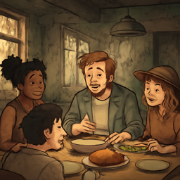
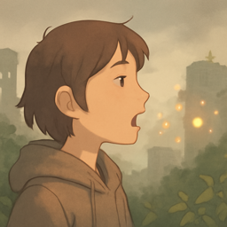
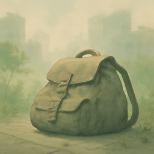

- [HSK1_001](#hsk1_001)
- [HSK1_002](#hsk1_002)
- [HSK1_003](#hsk1_003)
- [HSK1_004](#hsk1_004)
- [HSK1_005](#hsk1_005)
- [HSK1_006](#hsk1_006)
- [HSK1_007](#hsk1_007)
- [HSK1_008](#hsk1_008)
- [HSK1_009](#hsk1_009)
- [HSK1_010](#hsk1_010)
- [HSK1_011](#hsk1_011)
- [HSK1_012](#hsk1_012)
- [HSK1_013](#hsk1_013)
- [HSK1_014](#hsk1_014)
- [HSK1_015](#hsk1_015)
- [HSK1_016](#hsk1_016)
- [HSK1_017](#hsk1_017)
- [HSK1_018](#hsk1_018)
- [HSK1_019](#hsk1_019)
- [HSK1_020](#hsk1_020)
- [HSK1_021](#hsk1_021)
- [HSK1_022](#hsk1_022)
- [HSK1_023](#hsk1_023)
- [HSK1_024](#hsk1_024)
- [HSK1_025](#hsk1_025)
- [HSK1_026](#hsk1_026)
- [HSK1_027](#hsk1_027)
- [HSK1_028](#hsk1_028)
- [HSK1_029](#hsk1_029)
- [HSK1_030](#hsk1_030)
- [HSK1_031](#hsk1_031)
- [HSK1_032](#hsk1_032)
- [HSK1_033](#hsk1_033)
- [HSK1_034](#hsk1_034)
- [HSK1_035](#hsk1_035)
- [HSK1_036](#hsk1_036)
- [HSK1_037](#hsk1_037)
- [HSK1_038](#hsk1_038)
- [HSK1_039](#hsk1_039)
- [HSK1_040](#hsk1_040)
- [HSK1_041](#hsk1_041)
- [HSK1_042](#hsk1_042)
- [HSK1_043](#hsk1_043)
- [HSK1_044](#hsk1_044)
- [HSK1_045](#hsk1_045)
- [HSK1_046](#hsk1_046)
- [HSK1_047](#hsk1_047)
- [HSK1_048](#hsk1_048)
- [HSK1_049](#hsk1_049)
- [HSK1_050](#hsk1_050)

# HSK1_001

## 的 :: particle used to show emphasis or confirmation in a sentence

“This is true.”

这是真的。

## 我 :: I; me (used by the speaker to refer to themselves)

“I like milk.”

我喜欢牛奶。

## 你 :: you (referring to the person being spoken to)

“You are at home.”

你在家。

## 是 :: to be; is, am, are

“I am a student.”

我是学生。

## 了 :: indicates a completed action

“I have eaten.”

我吃了。

## 不 :: no; not

“I don't like it.”

我不喜欢。

## 在 :: in; at; on (to show location or time)

“I am at home.”

我在家。

## 他 :: he; him

“He is at home.”

他在家。

## 我们 :: we; us (refers to the speaker and at least one other person)

“We like to eat.”

我们喜欢吃饭。

## 好 :: good

“This rice is good.”

这个饭好。

# HSK1_002

## 有 :: to have; to possess

“I have a book.”

我有书。

## 这 :: this (refers to something nearby or just mentioned)

“This is water.”

这是水。

## 就 :: then; right away; an indicator to stress the result or evaluation

“She left, then I left.”

她走了，我就走。

## 会 :: can (to be able to do something); will (future tense)

“They can sing.”

他们会唱。

## 吗 :: Particle used to form a yes-no question.

“How are you?”

你好吗？

## 要 :: to want or need to do something; must

“I want to go.”

我要去。

## 什么 :: what; used to ask about something unknown

“What do you have?”

你有些什么？

## 说 :: to speak or talk

“She speaks.”

她说。

## 她 :: she; her (refers to a woman or girl)

“She is at school.”

她在学校。

## 想 :: to think or want to do something

“I want to eat.”

我想吃饭。

# HSK1_003

## 一 :: the number one

“I have one book.”

我有一本书。

## 很 :: very; quite (used for emphasis before adjectives)

“I am very happy.”

我很高兴。

## 知道 :: to know; to be aware of

“I know.”

我知道。

## 人 :: person; people

“They are Chinese people.”

他们是中国人。

## 吧 :: particle used to make suggestions or soften commands

“Let's eat together.”

我们一起吃饭吧。

## 那 :: that (used to refer to something far from the speaker)

“That is my book.”

那是我的书。

## 来 :: to come

“You come.”

你来。

## 都 :: all; every; both

“We are all at home.”

我们都在家。

## 个 :: piece (a measure word for things and people)

“One person.”

一个人。

## 能 :: can; to be able to

“I can smile.”

我能笑。

# HSK1_004

## 去 :: to go

“We go to school.”

我们去学校。

## 没 :: not; not have; without

“I don't have money.”

我没有钱。

## 和 :: and; with (used to connect words or people)

“I walk with you.”

我和你走。

## 他们 :: they; them (referring to a group of people)

“They are at school.”

他们在学校。

## 到 :: to arrive; to reach (a place or point in time)

“We arrive home.”

我们到家。

## 对 :: correct; right

“You are right.”

你说得对。

## 也 :: also; too

“I also like it.”

我也喜欢。

## 还 :: still; also; in addition

“I still have books.”

我还有书。

## 做 :: to make or do

“I cook food.”

我做饭。

## 给 :: to give; to hand over (something to someone)

“I give you a book.”

我给你一本书。

# HSK1_005

## 上 :: on; above

“The book is on the table.”

书在桌子上。

## 你们 :: you (plural); you all

“You all are here.”

你们在这。

## 过 :: used to show an action happened in the past

“He has been here before.”

他来过。

## 没有 :: not have; there is not

“I don't have money.”

我没有钱。

## 看 :: to see or look at

“I see you.”

我看你。

## 真 :: really; truly

“It's really big here.”

这里真大。

## 着 :: a particle showing ongoing action (like "-ing")

“He is singing.”

他在唱歌着。

## 事 :: thing; matter; event

“What is this thing?”

这是什么事？

## 怎么 :: how; in what way

“How do you go home?”

你怎么回家？

## 现在 :: now; at this moment

“We are at home now.”

现在我们在家。

# HSK1_006

## 点 :: measure word for a small amount or a dot

“There is a little water here.”

这里有一点水。

## 呢 :: particle used at the end of a sentence to turn it into a question or to emphasize something already mentioned

“And you?”

你呢？

## 不客气 :: you're welcome (polite reply to 'thank you')

“Thank you! You're welcome.”

谢谢你！不客气。

## 别 :: don't (used to tell someone not to do something)

“Don't go.”

别走。

## 走 :: to walk or to go

“I walk.”

我走。

## 太 :: too; extremely

“He is too happy.”

他太高兴了。

## 里 :: inside; in a space or area

“The book is inside.”

书在里。

## 跟 :: with; to follow; together with

“You come with me.”

你跟我来。

## 女孩儿 :: girl (with erhua, a northern accent)

“The girl is smiling.”

女孩儿在笑。

## 告诉 :: to tell or inform (someone)

“You tell him.”

你告诉他。

# HSK1_007

## 再 :: again

“Please say it again.”

请再说。

## 听 :: to listen

“They are listening to songs.”

他们在听歌。

## 这里 :: here; this place

“They are here.”

他们在这里。

## 快 :: fast; quick

“He is fast.”

他快。

## 谁 :: who; which person

“Who is at home?”

谁在家？

## 多 :: many; much; a lot

“There are many people here.”

这里有很多人。

## 用 :: to use

“I use a phone.”

我用手机。

## 时候 :: moment; time

“Now is the time.”

现在是时候。

## 下 :: under; below

“The water is under the table.”

水在桌子下。

## 谢谢 :: thank you

“Thank you.”

谢谢你。

# HSK1_008

## 觉得 :: to think or to feel (about something)

“I think (it is) good.”

我觉得好。

## 天 :: day

“Today's weather is very good.”

今天的天气很好。

## 请进 :: please come in

“Please come in.”

请进。

## 从 :: from (indicates starting point in time or space)

“I come from home.”

我从家来。

## 先生 :: Mr.; sir; a polite way to address a man

“Mr. is at home.”

先生在家。

## 找 :: to look for; to try to find

“He is looking for his phone.”

他找手机。

## 最 :: most; to the highest degree

“I like singing the most.”

我最喜欢唱歌。

## 喜欢 :: to like or love something or someone

“I like bread.”

我喜欢面包。

## 大 :: big or large

“Big tree.”

大树。

## 次 :: time (of an event); occurrence; next

“May I ask, when is the next time?”

请问，下一次是什么时候？

# HSK1_009

## 出 :: to come out; to go out

“He comes out.”

他出来。

## 干 :: to do or to work

“They are working.”

他们在干。

## 们 :: used after pronouns or person nouns to make them plural

“We are at school.”

我们在学校。

## 话 :: spoken words or speech

“He can speak.”

他会说话。

## 东西 :: thing; object

“There is a thing on the table.”

桌子上有东西。

## 孩子 :: child; kid

“The child is at home.”

孩子在家。

## 起来 :: to get up; to rise

“The student gets up.”

学生起来。

## 这些 :: these (used for multiple things or people close to the speaker)

“These books are good to read.”

这些书好看。

## 两 :: two

“Two students are here.”

两个学生在这里。

## 小孩儿 :: child; young child (with '儿' added at the end)

“The child is at home.”

小孩儿在家。

# HSK1_010

## 错 :: wrong; incorrect

“This is not right, it is wrong.”

这不对，是错。

## 还有 :: also; in addition

“I have rice, and also water.”

我有饭，还有水。

## 小 :: small or little

“The small girl is at home.”

小女孩儿在家。

## 中 :: center; middle

“I am in the center.”

我在中。

## 叫 :: to be called; to have as a name

“She is called little friend.”

她叫小朋友。

## 等 :: and so on; etc.

“I have bread, milk, and so on.”

我有面包、牛奶等。

## 一起 :: together; at the same time

“We walk together.”

我们一起走路。

## 拿 :: to take or hold something

“I take (hold) the cup.”

我拿杯子。

## 帮 :: to help

“I help you.”

我帮你。

## 打 :: to hit, to strike, or to play (by hitting)

“He plays ball.”

他打球。

# HSK1_011

## 爱 :: to love or like

“I love mom.”

我爱妈妈。

## 时间 :: time; a period or moment

“Time is important.”

时间很重要。

## 年 :: year

“Today is one year.”

今天是一年。

## 请 :: please; to ask or invite someone politely

“Please sit.”

请坐。

## 回 :: to return; to go back

“I go home.”

我回家。

## 工作 :: work; job

“He likes work.”

他喜欢工作。

## 见 :: to see or meet someone

“I see her.”

我见她。

## 钱 :: money; cash

“I have money.”

我有钱。

## 一样 :: same; alike

“The two bags are the same.”

两个包一样。

## 吃 :: to eat; to have food or a meal

“They are eating a meal.”

他们吃饭。

# HSK1_012

## 开 :: to open or turn on

“Turn on the TV.”

开电视。

## 家 :: home or family

“We are at home.”

我们在家。

## 非常 :: very; extremely

“This movie is very good to watch.”

这个电影非常好看。

## 看到 :: to see; to catch sight of

“I see her.”

我看到她。

## 那些 :: those (refers to several people or things far from the speaker)

“Those students are at the school.”

那些学生在学校。

## 哪 :: which (used to ask about one or more from a group)

“Which book is good?”

哪本书好？

## 行 :: to go; OK; to travel

“We go together.”

我们一起行。

## 朋友 :: friend

“A friend is here.”

朋友在这里。

## 妈妈 :: mother; mom

“Mother is at home.”

妈妈在家。

## 前 :: the front; the area ahead or in front

“There is a girl at the front.”

前有一个女孩儿。

# HSK1_013

## 这儿 :: here; this place

“I am here.”

我在这儿。

## 今天 :: today

“Today is good.”

今天好。

## 明白 :: to understand; to know clearly

“I understand.”

我明白。

## 车 :: car; vehicle

“The car is big.”

车很大。

## 地方 :: place; area; space; location

“This is a place.”

这里是一个地方。

## 几 :: how many; a few

“A few students are sitting at the table.”

几个学生坐在桌子上。

## 回来 :: to come back; to return

“The student comes back.”

学生回来。

## 准备 :: to get ready; to prepare

“I get ready for the exam.”

我准备考试。

## 找到 :: to find

“I found money.”

我找到钱。

## 后 :: at the back; behind

“The car is at the back.”

车在后。

# HSK1_014

## 爸爸 :: father; dad; papa

“Dad is at home.”

爸爸在家。

## 比 :: to compare

“I am taller than him.”

我比他高。

## 出来 :: come out; to emerge from inside to outside

“The child comes out.”

孩子出来。

## 对不起 :: I'm sorry; excuse me.

“Sorry, I came late.”

对不起，我来晚了。

## 问 :: to ask a question

“I ask you.”

我问你。

## 起 :: (a verb, meaning 'to rise' or 'to get up')

“The schoolchild rises.”

小学生起。

## 还是 :: still; or (expressing a choice between options)

“Still drink water.”

还是喝水。

## 住 :: to live (in a place); to stay; to reside

“He lives in the house.”

他住在房子里。

## 正 :: exactly; right on time

“It is raining right now.”

现在正下雨。

## 放 :: to put, to place, or to set down something

“I put the book on the table.”

我放书在桌子上。

# HSK1_015

## 请坐 :: Please have a seat.

“Please sit.”

请坐。

## 电话 :: telephone; phone call

“I have a telephone.”

我有电话。

## 地 :: ground; place; land

“We are on the ground.”

我们在地上。

## 进 :: to enter or go in

“We enter the house.”

我们进房子。

## 新 :: new

“We have new textbooks.”

我们有新课本。

## 您 :: you (polite form)

“You are at home.”

您在家。

## 一些 :: some; a few

“There are some buns here.”

这里有一些包子。

## 三 :: three (the number 3)

“Three people are at the school.”

三个人在学校。

## 那里 :: that place

“There is a restaurant there.”

那里有饭店。

## 高兴 :: happy; glad

“I am very happy.”

我很高兴。

# HSK1_016

## 老 :: old; elderly (used for people or things)

“The elderly person sits next to the table.”

老人坐在桌子旁边。

## 先 :: earlier; first; before others

“Come first.”

先来。

## 买 :: to buy or purchase

“I bought fruit.”

我买了水果。

## 医生 :: doctor; a person who treats sick people

“The doctor is at home.”

医生在家。

## 最后 :: final; last; at the end

“Eat at the end.”

最后吃饭。

## 手 :: hand

“He has a hand.”

他有手。

## 哪儿 :: where (used to ask about a place or location)

“Where is the money?”

钱在哪儿？

## 女人 :: an adult female person; woman

“The woman is at home.”

女人在家。

## 名字 :: name; a person's name

“Her name is Xiao.”

她的名字是小。

## 认识 :: to know or recognize (someone or something)

“I know him.”

我认识他。

# HSK1_017

## 坐 :: to sit

“We sit together.”

我们坐在一起。

## 喝 :: to drink

“I drink water.”

我喝水。

## 记得 :: to remember; to recall

“I remember her.”

我记得她。

## 写 :: to write

“I write.”

我写。

## 穿 :: to wear or put on (clothes)

“She puts on clothes.”

她穿衣服。

## 哪里 :: where

“Where are you going?”

你去哪里？

## 送 :: to give as a present, to deliver, or to see someone off

“I walk him home.”

我送他回家。

## 跑 :: to run or move quickly on foot

“The primary school student runs.”

小学生跑。

## 月 :: moon

“There is a moon at night.”

晚上有月。

## 早 :: early; before the usual time

“He studies in the early morning.”

他早上学习。

# HSK1_018

## 号 :: used for numbers, dates, or numbers in a list

“Today is the 3rd.”

今天是三号。

## 小时 :: hour (a unit of time equal to 60 minutes)

“I have one hour.”

我有一个小时。

## 重要 :: important

“This is important.”

这个很重要。

## 别人 :: other people

“There are other people here.”

这里有别人。

## 男人 :: man; adult male

“The man is at home.”

男人在家。

## 岁 :: year of age

“He is seven years old.”

他七岁。

## 出去 :: to go out; to leave (a place)

“I go out.”

我出去。

## 看见 :: to see; to catch sight of

“I see you.”

我看见你。

## 打电话 :: to make a phone call

“They make a phone call.”

他们打电话。

## 得到 :: to get or receive

“I get a cup.”

我得到一个杯子。

# HSK1_019

## 儿子 :: son; male child

“Dad has a son.”

爸爸有一个儿子。

## 再见 :: goodbye

“Goodbye!”

再见！

## 本 :: measure word for books or notebooks

“This book is good.”

这本书好看。

## 马上 :: right away; immediately

“We finish class right away.”

我们马上下课。

## 那儿 :: that place; there

“My friend is there.”

朋友在那儿。

## 难 :: difficult; hard

“The test is difficult.”

考试很难。

## 明天 :: the day after today

“We will meet tomorrow.”

明天我们见。

## 站 :: to stand up; to be standing

“They stand on the bus.”

他们站在车上。

## 多少 :: how many; how much

“How much money do you have?”

你有多少钱？

## 晚上 :: evening; night

“In the evening, I am at home.”

晚上我在家。

# HSK1_020

## 没什么 :: it's nothing; never mind

“It's nothing.”

没什么。

## 块 :: measure word for pieces or chunks

“I want one piece.”

我要一块。

## 回家 :: go back home

“They go back home.”

他们回家。

## 说话 :: to talk or speak

“They are talking.”

他们说话。

## 花 :: to spend (money or time)

“Mom spends money.”

妈妈花钱。

## 她们 :: they (for females)

“They are laughing.”

她们在笑。

## 有些 :: some; a few; several

“Some students like watching movies.”

有些学生喜欢看电影。

## 门 :: door

“The door is here.”

门在这儿。

## 女儿 :: daughter

“She is the daughter.”

她是女儿。

## 小姐 :: Miss; young lady

“The young lady is here.”

小姐在这儿。

# HSK1_021

## 动 :: to move; to change position

“Primary school students move by walking.”

小学生走路动。

## 女 :: girl or woman

“The girl is at home.”

女在家。

## 忙 :: busy

“She is very busy.”

她很忙。

## 房子 :: house or building (usually less than three stories)

“She is in the house.”

她在房子里。

## 衣服 :: clothes

“She has clothes.”

她有衣服。

## 睡 :: to sleep

“She sleeps.”

她睡。

## 回去 :: to go back or return somewhere

“She goes back.”

她回去。

## 晚 :: late (in the day or at night)

“She is at home at night.”

晚上她在家。

## 坏 :: bad; broken

“The thing is broken.”

东西坏了。

## 水 :: water

“The water is in the cup.”

水在杯子里。

# HSK1_022

## 杯 :: cup; a container for drinking

“I have a cup.”

我有一个杯。

## 学校 :: school; a place where people go to study or learn

“She studies at school.”

她在学校学习。

## 高 :: tall; high (in height)

“He is tall.”

他很高。

## 电影 :: movie; film

“I like movies.”

我喜欢电影。

## 试 :: to try or test

“I try things.”

我试东西。

## 身上 :: on the body

“He has something on his body.”

他身上有东西。

## 房间 :: room (in a house or building)

“She is in the room.”

她在房间。

## 书 :: book

“She has a book.”

她有书。

## 球 :: ball

“He has a ball.”

他有一个球。

## 忘 :: to forget

“She forgot her phone.”

她忘了手机。

# HSK1_023

## 进来 :: come in

“She comes in.”

她进来。

## 路 :: road or path

“There is a car on the road.”

路上有车。

## 四 :: the number four (4)

“Four students are studying.”

四个学生在学习。

## 第 :: marker for ordinal numbers (like 'first', 'second')

“She is first.”

她第。

## 进去 :: to go in; to enter

“They go in.”

他们进去。

## 听到 :: to hear; to hear something

“I hear water.”

我听到水。

## 正在 :: in the process of (doing something)

“I am studying.”

我正在学习。

## 笑 :: smile or laugh

“They smile.”

他们笑。

## 那边 :: that side; over there

“She is over there.”

她在那边。

## 远 :: far away

“She is far away outside.”

她在外边很远。

# HSK1_024

## 床 :: bed

“She is on the bed.”

她在床上。

## 歌 :: song

“I like to sing songs.”

我喜欢唱歌。

## 唱 :: to sing

“She sings.”

她唱。

## 别的 :: other; different one(s)

“I have other things.”

我有别的东西。

## 学 :: to study or to learn

“You are studying.”

你在学习。

## 关 :: to close or turn off (something)

“Close the door.”

关门。

## 五 :: the number five (5)

“Five children are laughing.”

五个小孩儿在笑。

## 男 :: male; man; boy

“The boy is at school.”

男生在上学。

## 帮忙 :: to help someone; to give help

“They help.”

他们帮忙。

## 国家 :: country; a nation or state

“She is in the country.”

她在国家。

# HSK1_025

## 间 :: room

“She is in the room.”

她在房间。

## 分 :: measure word for parts or portions

“Please give me three portions.”

请给我三分。

## 医院 :: hospital

“She is in the hospital.”

她在医院。

## 半 :: half

“She has half a loaf of bread.”

她有半个面包。

## 少 :: not enough; fewer than needed

“There is one person less here.”

这儿少一个人。

## 没关系 :: it's okay; no problem

“It's okay.”

没关系。

## 真的 :: really; truly

“He is really happy.”

他真的高兴。

## 教 :: to teach

“The teacher teaches students.”

老师教学生。

## 重 :: heavy; important

“The thing is heavy.”

东西很重。

## 飞机 :: Airplane; a vehicle that flies in the sky.

“The airplane is in the sky.”

飞机在天上。

# HSK1_026

## 打开 :: to open or turn on (something)

“Turn on the TV.”

打开电视。

## 早上 :: early morning

“In the early morning, she drinks milk.”

早上她喝奶。

## 二 :: two; the number 2

“She has two things.”

她有二个东西。

## 电视 :: TV; television; a device for watching programs and shows.

“She is watching TV.”

她在看电视。

## 回到 :: to return to (a place); to go back

“I return home.”

我回到家。

## 身体 :: body; a person's physical body or health

“Her body is very healthy.”

她的身体很好。

## 读 :: to read (aloud) or study

“She is reading a book.”

她在读书。

## 这边 :: this side, here

“There is fruit on this side.”

这边有水果。

## 家里 :: at home

“She is at home.”

她在家里。

## 昨天 :: the day before today

“It rained yesterday.”

昨天下雨。

# HSK1_027

## 大学 :: university; a place to study after high school

“She is at the university.”

她在大学。

## 记 :: to write down or remember

“She writes things down.”

她记东西。

## 口 :: mouth

“She has a mouth.”

她有口。

## 日 :: (noun) day; the basic unit of the date in Chinese

“Today the day is good.”

今天日好。

## 休息 :: to rest or take a break

“They rest.”

他们休息。

## 回答 :: to answer; to reply

“She answers.”

她回答。

## 外 :: outside

“They are outside.”

他们在外。

## 子 :: child; son; also used as a noun suffix.

“He is my son.”

他是我的儿子。

## 六 :: the number six

“Six students.”

六个学生。

# HSK1_028

## 飞 :: to fly

“The bird flies.”

鸟飞。

## 老师 :: teacher; instructor

“The teacher is at school.”

老师在学校。

## 不用 :: do not need to; not necessary

“No need to walk.”

不用走。

## 星期 :: week; also means 'Sunday' in some contexts

“Week is at the school.”

星期在学校。

## 生气 :: to be angry; to get angry

“He is angry.”

他生气。

## 生日 :: birthday

“Today is (my) birthday.”

今天是生日。

## 病 :: illness; sickness

“He is sick.”

他有病。

## 包 :: bag; package; a container used to hold things

“The bag is on the table.”

包在桌子上。

## 哥哥 :: older brother

“Older brother is at school.”

哥哥在学校。

## 票 :: ticket (for entry, travel, or events)

“I have a ticket.”

我有票。

# HSK1_029

## 手机 :: cell phone

“I have a cell phone.”

我有手机。

## 忘记 :: to forget

“He forgets.”

他忘记。

## 十 :: ten (the number 10)

“Ten students are at the school.”

十个学生在学校。

## 楼 :: building with more than one floor; floor of a building

“She is upstairs.”

她在楼上。

## 记住 :: to remember something clearly

“I remember him.”

我记住他。

## 洗 :: to wash or clean something with water

“I wash my hands.”

我洗手。

## 干什么 :: do what; what are you doing

“What are you doing?”

你干什么？

## 病人 :: patient (a person who is ill or receiving medical care)

“The patient is very tired.”

病人很累。

## 弟弟 :: younger brother

“Younger brother is at home.”

弟弟在家。

## 见面 :: to meet someone

“We meet.”

我们见面。

# HSK1_030

## 来到 :: to arrive; to come to a place

“He arrives at the school.”

他来到学校。

## 一会儿 :: a short time; in a little while

“We will leave in a little while.”

我们一会儿走。

## 妹妹 :: younger sister

“Younger sister is at home.”

妹妹在家。

## 电脑 :: computer

“The student uses a computer.”

学生用电脑。

## 认真 :: serious; earnest; doing something carefully and with a lot of attention.

“He is very serious.”

他很认真。

## 热 :: hot (having a high temperature)

“The water is hot.”

水很热。

## 差 :: to lack; not enough

“There is not enough water here.”

这里的水差。

## 饿 :: hungry

“He is hungry.”

他很饿。

## 学生 :: student; a person who attends school to learn.

“The student is at school.”

学生在学校。

## 下午 :: afternoon (the time after noon and before evening)

“The afternoon weather is good.”

下午天气好。

# HSK1_031

## 动作 :: action or movement

“They have movement.”

他们有动作。

## 慢 :: slow; not fast

“He is slow.”

他慢。

## 家人 :: family members; the people in a family

“My family loves me.”

家人爱我。

## 坐下 :: to sit down

“They sit down.”

他们坐下。

## 白 :: white (color)

“The white flower looks beautiful.”

白花好看。

## 姐姐 :: older sister

“Older sister is at home.”

姐姐在家。

## 女朋友 :: girlfriend; a girl who is someone's romantic partner

“He has a girlfriend.”

他有女朋友。

## 一半 :: one half; 50% of something

“I have one half.”

我有一半。

## 西 :: west; the direction where the sun sets

“The sun is in the west.”

太阳在西。

## 一边 :: at the same time; doing two things together

“They sing and laugh at the same time.”

他们一边唱，一边笑。

# HSK1_032

## 听见 :: to hear

“I heard it.”

我听见了。

## 介绍 :: to introduce someone or something

“I will introduce him.”

我来介绍他。

## 字 :: written character or word

“I recognize this character.”

我认识这个字。

## 男朋友 :: boyfriend

“He is the boyfriend.”

他是男朋友。

## 肉 :: meat; flesh

“I eat meat.”

我吃肉。

## 有时候 :: sometimes; at certain times but not always

“Sometimes I am at home.”

有时候我在家。

## 开玩笑 :: to joke; to make a joke; to kid around

“They are joking.”

他们开玩笑。

## 路上 :: on the road

“We are on the road.”

我们在路上。

## 学习 :: to study or learn something

“They study.”

他们学习。

## 累 :: tired; feeling tired or weary

“I am very tired.”

我很累。

# HSK1_033

## 汽车 :: car; motor vehicle

“They have a car.”

他们有汽车。

## 冷 :: cold; low in temperature

“Today is cold.”

今天冷。

## 下次 :: the next time; on another occasion

“See you next time.”

下次见。

## 班 :: a measure word for classes or lessons

“Our class has students.”

我们班有学生。

## 课 :: class or lesson

“They have class.”

他们上课。

## 上班 :: to go to work; to start one's work shift

“We go to work.”

我们上班。

## 山 :: mountain or hill

“The mountain is in front.”

山在前边。

## 干净 :: clean; not dirty

“The table is very clean.”

桌子很干净。

## 树 :: tree

“We see a tree.”

我们看到树。

## 吃饭 :: to have a meal; to eat

“We are eating.”

我们吃饭。

# HSK1_034

## 旁边 :: next to; beside

“The book is beside the table.”

书在桌子旁边。

## 八 :: the number eight

“Eight students.”

八个学生。

## 毛 :: hair or fur

“I have hair.”

我有毛。

## 常 :: often; frequently

“They often eat rice.”

他们常吃米饭。

## 中国 :: China (the country)

“I love China.”

我爱中国。

## 七 :: the number seven

“Seven students.”

七个学生。

## 菜 :: vegetable or a dish of food

“They have vegetables (dishes/food).”

他们有菜。

## 元 :: a unit of Chinese currency (yuan)

“I have twenty yuan.”

我有二十元。

## 奶奶 :: grandma (especially father's mother)

“Grandma is at home.”

奶奶在家。

## 去年 :: last year

“Last year I went home.”

去年我回家。

# HSK1_035

## 开车 :: to drive a car

“The girl is driving a car.”

女生开车。

## 风 :: wind

“The wind is at the place.”

风在地点。

## 饭 :: cooked rice or a meal

“There is rice on the table.”

桌子上有饭。

## 今年 :: this year

“I am happy this year.”

今年我高兴。

## 左 :: left side

“He is on the left side.”

他在左边。

## 地点 :: place or location

“We are at a new place.”

我们在一个新地点。

## 右 :: right side

“There is a tree on the right side.”

右边有树。

## 女生 :: female student or girl

“The girl is at school.”

女生在学校。

## 上次 :: last time

“Last time I was at home.”

上次我在家。

## 桌子 :: table

“There is a book on the table.”

桌子上有书。

# HSK1_036

## 机场 :: airport

“We are at the airport.”

我们在机场。

## 爷爷 :: grandpa (father's father)

“Grandpa is at home.”

爷爷在家。

## 晚饭 :: evening meal; dinner

“Eat dinner in the evening.”

晚上吃晚饭。

## 中间 :: the middle or center of something

“The book is in the middle.”

书在中间。

## 唱歌 :: to sing songs

“He sings.”

他唱歌。

## 电 :: electricity; electric

“I have electricity.”

我有电。

## 火车 :: train (a vehicle that runs on tracks and carries people or goods)

“The train is on the road.”

火车在路上。

## 不对 :: not correct; wrong

“This is not correct.”

这个不对。

## 地上 :: on the ground; on the floor

“The cup is on the ground.”

杯子在地上。

## 午饭 :: lunch (the meal eaten around noon)

“We eat lunch at noon.”

我们中午吃午饭。

# HSK1_037

## 有的 :: some (used for part of a group)

“Some people study.”

有的人学习。

## 东 :: east

“There is a home on the east side.”

东边有一个家。

## 雨 :: rain

“It's raining.”

雨在下。

## 好看 :: good-looking; nice; pleasant to look at

“He is good-looking.”

他很好看。

## 车上 :: on the car; in the car

“We are in the car.”

我们在车上。

## 天气 :: the weather; the state of the sky, including sun, rain, or clouds

“The weather is very good.”

天气很好。

## 茶 :: tea (a drink made by soaking leaves in hot water)

“I like tea.”

我喜欢茶。

## 上学 :: to go to school

“The child goes to school.”

小朋友上学。

## 九 :: the number nine

“Nine children are studying.”

九个小朋友在学。

## 商店 :: store; shop

“I am in the shop.”

我在商店。

# HSK1_038

## 好吃 :: delicious; tastes good

“This bread is delicious.”

这个面包好吃。

## 地图 :: a drawing that shows where places are

“I have a map.”

我有一个地图。

## 面包 :: bread

“I like to eat bread.”

我喜欢吃面包。

## 页 :: page (of a book or paper)

“I have a book with five pages.”

我有一本书，有五页。

## 南 :: south; southern direction

“I am in the south.”

我在南。

## 男生 :: male student or boy

“The boy student is at school.”

男生在学校。

## 考试 :: test or exam

“They are taking a test.”

他们考试。

## 没事儿 :: It's nothing; never mind.

“It's nothing, I am happy.”

没事儿，我很高兴。

## 左边 :: on the left side

“I am on the left side.”

我在左边。

## 同学 :: classmate; a fellow student in the same class

“The classmate is here.”

同学在这里。

# HSK1_039

## 北 :: north; northern direction

“The north wind is blowing.”

北风在吹。

## 请问 :: Excuse me, may I ask...?

“Excuse me, is there water here?”

请问，这里有水吗？

## 百 :: hundred

“There are 100 children here.”

这里有百个小孩儿。

## 网上 :: on the internet; online

“I am online.”

我在网上。

## 贵 :: expensive; costs a lot of money

“This meal is expensive.”

这个饭很贵。

## 洗手间 :: washroom; a place to wash your hands and use the toilet

“There is a washroom here.”

这里有洗手间。

## 楼上 :: upstairs; the floor above

“They are upstairs.”

他们在楼上。

## 一点儿 :: a little; a bit

“I have a little bit of money.”

我有一点儿钱。

## 生病 :: to get sick; to be ill

“He is sick.”

他生病。

# HSK1_040

## 最好 :: had better; it is best to

“You had better drink water.”

你最好喝水。

## 国 :: country or nation

“China is a country.”

中国是国家。

## 在家 :: at home

“I am at home.”

我在家。

## 学院 :: college or institute

“The college is here.”

学院在这里。

## 牛奶 :: milk from a cow

“I drink milk.”

我喝牛奶。

## 右边 :: right side

“He is on the right side.”

他在右边。

## 楼下 :: downstairs; the floor below

“They are downstairs.”

他们在楼下。

## 门口 :: doorway or entrance

“We are at the doorway.”

我们在门口。

## 下班 :: finish work

“We finish work.”

我们下班。

## 上课 :: to attend class or to give a class/lesson

“We have class.”

我们上课。

# HSK1_041

## 考 :: to take or give a test; to examine

“He is going to take a test.”

他要考试。

## 起床 :: to get up from bed

“I get up.”

我起床。

## 奶 :: milk

“The child drinks milk.”

小朋友喝奶。

## 图书馆 :: a place where you can read and borrow books

“I am at the library.”

我在图书馆。

## 走路 :: to walk; to go on foot

“He walks.”

他走路。

## 常常 :: often; many times

“He often goes to school.”

他常常去学校。

## 鸡蛋 :: egg (from a chicken)

“I have an egg.”

我有一个鸡蛋。

## 关上 :: to close (a door or window) or turn off (lights, equipment)

“He closes the door.”

他关上门。

## 饭店 :: restaurant

“We eat at the restaurant.”

我们在饭店吃饭。

## 中午 :: noon; midday

“He is at home at noon.”

中午他在家。

# HSK1_042

## 明年 :: next year

“Next year we will go to Beijing.”

明年我们去北京。

## 老人 :: an old person, especially a man or woman

“The old person smiles.”

老人笑。

## 读书 :: to read books or study

“He is reading a book.”

他在读书。

## 工人 :: worker; person who does physical or manual work

“The worker is here.”

工人在这里。

## 上午 :: morning

“I like the morning.”

我喜欢上午。

## 水果 :: fruit (something you can eat that grows on trees or plants, like apples or bananas)

“I like fruit.”

我喜欢水果。

## 白天 :: daytime; the time when it is light outside

“It is hot during the day.”

白天很热。

## 零 :: zero; the number 0

“There is a zero on the ground.”

地上有零。

## 打球 :: to play ball games

“I play ball.”

我打球。

## 开会 :: to have a meeting

“We have a meeting.”

我们开会。

# HSK1_043

## 知识 :: knowledge; what you know or understand about something

“He has knowledge.”

他有知识。

## 上车 :: to get on a bus, train, car, or other vehicle

“They get on the bus.”

他们上车。

## 车站 :: place where you get on or off a train or bus

“The station is here.”

车站在这边。

## 杯子 :: cup or glass for drinking

“I have a cup.”

我有一个杯子。

## 有用 :: useful; helpful

“This smartphone is very useful.”

这个手机很有用。

## 哪些 :: which ones

“Which ones do you like?”

你喜欢哪些？

## 早饭 :: the morning meal; breakfast

“She likes breakfast.”

她喜欢早饭。

## 机票 :: plane ticket

“He has a plane ticket.”

他有机票。

## 玩儿 :: to play or have fun

“They play.”

他们玩儿。

# HSK1_044

## 星期天 :: Sunday; the day of the week after Saturday

“I am at home on Sunday.”

星期天我在家。

## 小朋友 :: child; little boy or girl

“The child is smiling.”

小朋友在笑。

## 新年 :: New Year

“The New Year has come.”

新年来了。

## 爱好 :: something you like to do; hobby

“I like singing.”

我爱好唱歌。

## 商场 :: a large store or building with many shops

“They are at the mall.”

他们在商场。

## 是不是 :: is it or not; whether or not

“Is it them or not?”

是不是他们？

## 放学 :: finish classes for the day

“School is over.”

放学了。

## 好听 :: sounds nice

“This song sounds nice.”

这歌好听。

## 有名 :: famous

“He is famous.”

他是有名。

## 中学 :: middle school (for students aged about 12-15)

“He is at (a) middle school.”

他在中学。

# HSK1_045

## 马路 :: road; street (for vehicles)

“The car is on the road.”

车在马路上。

## 门票 :: admission ticket

“I have a ticket.”

我有门票。

## 小学 :: a school for young children, usually the first years of school

“She is at the elementary school.”

她在小学。

## 上网 :: to go online

“I am going online.”

我在上网。

## 一块儿 :: together (to do something with others)

“We eat together.”

我们一块儿吃饭。

## 电视机 :: television; a device for watching TV programs

“I have a television.”

我有电视机。

## 外国 :: foreign country

“He is in a foreign country.”

他在外国。

## 渴 :: feeling the need to drink water

“I am thirsty.”

我渴。

## 国外 :: abroad

“He is abroad.”

他在国外。

## 书店 :: A place where you can buy books.

“There is a bookstore here.”

这儿有书店。

# HSK1_046

## 下车 :: get off a vehicle

“He gets off the vehicle.”

他下车。

## 下雨 :: rain; to rain (weather when water falls from the sky)

“It is raining today.”

今天下雨。

## 大学生 :: college or university student

“The university student is at school.”

大学生在学校。

## 电影院 :: cinema; movie theater

“Here is the cinema.”

这儿是电影院。

## 路口 :: place where two roads meet

“I am at the intersection.”

我在路口。

## 车票 :: ticket for a train or bus

“I have a train/bus ticket.”

我有车票。

## 不大 :: not very; not big; not much

“This book is not big.”

这本书不大。

## 北边 :: north side; the area to the north

“The school is on the north side.”

学校在北边。

## 放假 :: to be on holiday or take a break from work or school

“We are on holiday.”

我们放假。

## 南边 :: the south side; the area to the south

“The school is on the south side.”

学校在南边。

# HSK1_047

## 外边 :: outside; not inside a place

“They are outside.”

他们在外边。

## 西边 :: west side; the direction to the west

“There are flowers on the west side.”

西边有花。

## 看病 :: to see a doctor

“I go to see a doctor.”

我去看病。

## 米饭 :: cooked rice

“I like to eat rice.”

我喜欢吃米饭。

## 请假 :: to ask for leave from work or school

“I ask for leave.”

我请假。

## 北京 :: Beijing, the capital city of China.

“I am in Beijing.”

我在北京。

## 中文 :: Chinese language (written form)

“I study Chinese.”

我学中文。

## 里边 :: inside; the inner part of something

“The kitten is inside.”

小猫在里边。

## 东边 :: east side; the area to the east

“The flower is on the east side.”

花在东边。

## 下课 :: finish class

“Class is over.”

下课了。

# HSK1_048

## 半天 :: a long time; half a day

“He waited for a long time.”

他等了半天。

## 前天 :: the day before yesterday

“The day before yesterday I went to school.”

前天我上学。

## 上边 :: above; on top of

“The water is on top.”

水在上边。

## 本子 :: notebook

“I have a notebook.”

我有本子。

## 后边 :: behind; at the back

“The child is behind.”

小朋友在后边。

## 书包 :: schoolbag; a bag for carrying books and school things

“The schoolbag is on the desk.”

书包在桌子上。

## 后天 :: the day after tomorrow

“See you the day after tomorrow.”

后天见。

## 好玩儿 :: fun; amusing

“Today is fun.”

今天好玩儿。

## 课本 :: textbook

“I have a textbook.”

我有课本。

# HSK1_049

## 外语 :: a language that is not your own; a foreign language

“He is learning a foreign language.”

他学外语。

## 打车 :: to take a taxi

“I take a taxi home.”

我打车回家。

## 小学生 :: Primary school student

“The primary school student is at school.”

小学生在学校。

## 下边 :: under; below; the lower side

“The water is underneath.”

水在下边。

## 中学生 :: middle school student

“The middle school student is at school.”

中学生在学校。

## 汉语 :: Chinese language

“He studies Chinese.”

他学汉语。

## 包子 :: steamed stuffed bun

“I love to eat steamed stuffed buns.”

我爱吃包子。

## 前边 :: in front; the front side

“The car is in front.”

车在前边。

## 教学楼 :: school building

“The school building is there.”

教学楼在那儿。

## 汉字 :: Chinese character used in writing Chinese.

“I can write Chinese characters.”

我会写汉字。

# HSK1_050

## 网友 :: online friend

“An online friend comes to my home.”

网友来我家。

## 听写 :: dictation (writing down what you hear)

“The teacher gives a dictation.”

老师听写。

## 课文 :: text (used for study)

“I read the text.”

我读课文。

## 半年 :: six months

“I am at home for half a year.”

我在家半年。

## 面条儿 :: noodles (with the 'er' sound in Beijing accent)

“I eat noodles.”

我吃面条儿。

## 男孩儿 :: boy (child who is male)

“The boy walks.”

男孩儿走路。

## 一下儿 :: a short while; a little bit; once briefly

“I will try (it) for a bit.”

我试一下儿。

